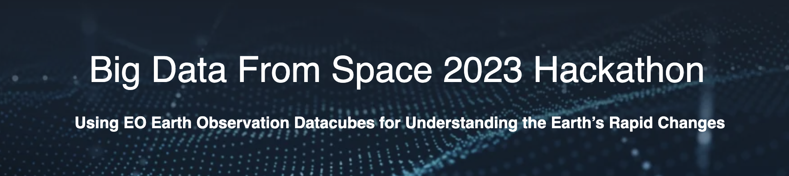

<div align="center">
  <p>
    <a href="https://pages.earthdaily.com/hackathon">
        
    </a>
</p>
</div>

This repository contains scripts and notebooks for the [EarthDaily Analytics Hackathon](https://pages.earthdaily.com/hackathon) at [BiDS 2023](https://www.bigdatafromspace2023.org/). There is material for people who want to focus on data access and data visualisation, and material for people who want to explore machine learning. Of course you can combine these, for example by first training a model and then processing imagery generated via STAC to build cool analytics applications!

The following notebooks are focused on data access and data visualization: 
- stac-notebooks
- stac-app

The following notebooks are focused on machine learning: 
- edagro-crop-detection
- sentinel2-modelling

Please see the README.md for each notebook for additional descriptions. 

We highly encourage participants in the BiDS 2023 Hackathon to set up their development environment and become familiar with running the notebooks prior to the event!

# Setup

## Option: Hosted Environments

There are a few options available for running the notebooks in a hosted environment: 
- To run the notebooks without leaving Github or setting up a Python environment you can use a [codespace](https://github.com/features/codespaces). This approach will be demonstrated. Note however that codespaces do not provide a GPU (to the best of our knowledge).
- In [Google Colab](https://research.google.com/colaboratory/), [AWS Sagemaker Studio Lab](https://studiolab.sagemaker.aws/) or on [lightning.ai](https://lightning.ai/) you just need to git clone this repository. 

Each notebook has specific environment requirements. To install these requirements: 
```
cd <notebook-subdir>  # E.g. edagro-crop-detection
pip install -r requirements.txt
```

## Option: Local Environment

If you wish to develop locally, one option is to use the Mamba package manager: 
- Download mamba : https://github.com/conda-forge/miniforge#mambaforge.
- If you're using PowerShell, copy/paste this to have the Mamba commands : ```powershell -ExecutionPolicy ByPass -NoExit -Command "& 'C:\Users\$Env:UserName\AppData\Local\mambaforge\condabin\mamba.bat' init powershell"```

Each notebook has specific environment requirements. To create Mamba environment and install these requirements: 
- Then create the bids23_<notebook> environment : `mamba env update --name bids23 --file requirements.yml`.

The notebook can then be run: `mamba activate bids23` and `jupyter notebook`.

To run the `stac-app`, clone the repo to your machine and follow the instructions in `stac-app/README.md`.


## EDS Credentials Setup 
If you are participating in the BiDS 2023 Hackathon, you should have received credentials to access the EDS. Make a copy of `.env.sample` to `.env` and fill in the credentials and access information as provided. 


# License
TBC
=======

# Need Help? 
If you are participating in the BiDS 2023 Hackathon, you should have received an invite to the Slack channel for communication and coordination prior to the event. Prior to the event, feel free to ask questions in that channel. 